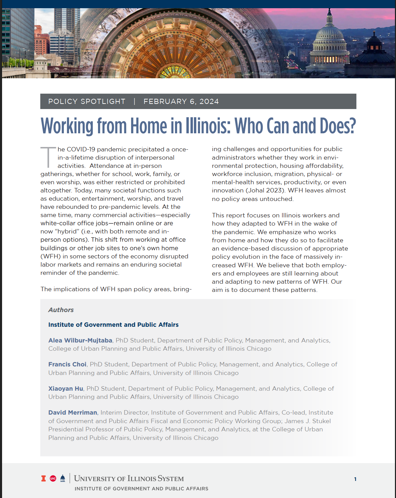

# Supporting data and code used for IGPA publication

Working from Home in Illinois: Who Can and Who Does? by Alea Wilbur-Mujtaba, Francis Choi, Xiaoyan Hu, and David Merriman. February 2024. Institute of Government Affairs.

-   [Read the full report here](https://igpa.uillinois.edu/reports/working-from-home-in-illinois-who-can-and-does): <https://igpa.uillinois.edu/reports/working-from-home-in-illinois-who-can-and-does>

-   GitHub Website containing images, code, and some commentary: <https://aleawm.github.io/WorkFromHome/>

*Note: Website is a work in progress.*

## Contents

-   Code and images for [Descriptive Statistics](https://aleawm.github.io/WorkFromHome/DescriptiveStatistics.html)

-   See the [Maps section](https://aleawm.github.io/WorkFromHome/Maps.html) or maps created in the paper (and bonus images!)

-   See [Appendix items](https://aleawm.github.io/WorkFromHome/Appendix1.html)for code behind supporting graphs in the articles appendix.

[{#papercover width="178"}](https://igpa.uillinois.edu/reports/working-from-home-in-illinois-who-can-and-does)
